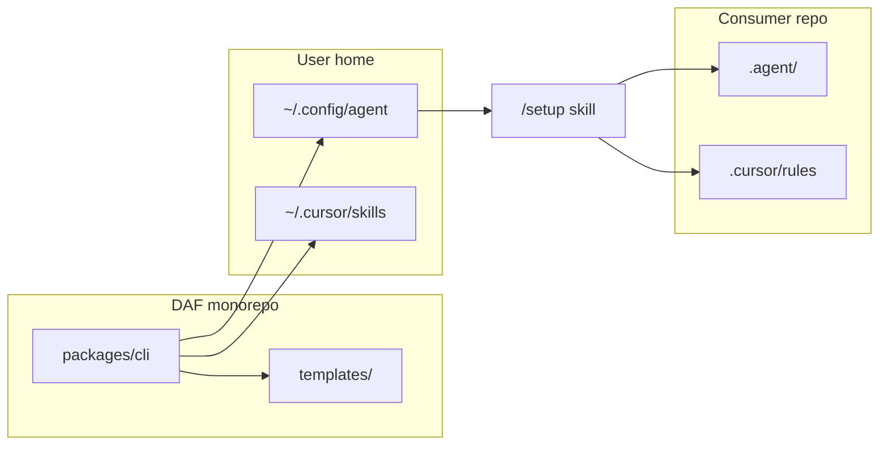

# Architecture — DAF monorepo

## Modules

| Area | Path | Responsibility |
|------|------|----------------|
| **CLI** | `packages/cli/src/` | Parse and run `daf global-setup`; copy templates to `~/.config/agent`. |
| **Config** | `packages/cli/src/config.ts` | Parse/write `.agent/config.json` contract. |
| **Verify state** | `packages/cli/src/verify-state.ts` | `buildInitialVerifyState` for tests; agents mirror in `/setup`. |
| **Global install** | `packages/cli/src/global-install.ts` | Copy `templates/global`, write `daf-*.md` skills from manifest, stacks, scaffold. |
| **Cursor install** | `packages/cli/src/platforms/cursor.ts` | Build `~/.cursor/skills/daf-*/SKILL.md` + platform project overlay. |
| **Checklist** | `packages/cli/src/checklists/planning-to-developing.ts` | `validatePlanningExit` thresholds for leaving planning. |
| **Paths** | `packages/cli/src/paths.ts` | Repo root, `DAFE_GLOBAL_ROOT`, `DAF_CURSOR_SKILLS_ROOT`. |
| **Templates** | `templates/` | Source of truth shipped beside CLI; copied on `global-setup`. |

## Boundaries

- **CLI must not** embed LLM clients, run agents, or make network calls.
- **Agents** read/write `.agent/config.json` per skills; they do not invent phase or stack.
- **`/setup`** is an IDE skill — greenfield copies scaffold; brownfield interviews then merges and populates docs.
- **Templates** in repo are canonical; `~/.config/agent/` is an installed copy.

## Data flow

## Tests

Vitest unit tests co-located as `*.test.ts`. Use temp dirs and `DAFE_GLOBAL_ROOT` / `DAF_CURSOR_SKILLS_ROOT` for isolation.
