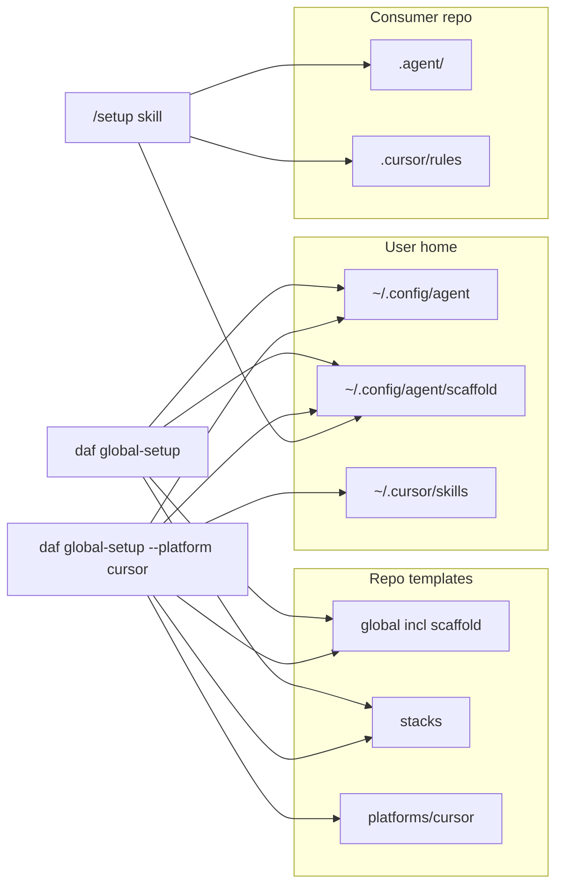

# Architecture — DAF monorepo

## Modules

| Area | Path | Responsibility |
|------|------|----------------|
| **CLI** | `packages/cli/src/` | Parse `daf global-setup`; copy templates into `~/.config/agent` (+ scaffold, stacks); optional Cursor skills. |
| **Config** | `packages/cli/src/config.ts` | Parse `.agent/config.json` (`phase` includes `maintaining`, `stack`, `check`, `taskCheck`, `codebaseEvery`, `initialTaskCount`, optional `platform`, optional `defaultBranch`). |
| **Verify state** | `packages/cli/src/verify-state.ts` | `buildInitialVerifyState` / `writeVerifyState` — used by tests; agents mirror formulas in `/setup`. |
| **Global install** | `packages/cli/src/global-install.ts` | Copies `templates/global` except raw `skills/`; writes `~/.config/agent/skills/daf-*.md` from `templates/global/skill-manifest.json`; stacks; optional `root-AGENTS.md`; optional `platforms/cursor/project` into `~/.config/agent`. |
| **Checklist** | `packages/cli/src/checklists/planning-to-developing.ts` | `validatePlanningExit` — checklist thresholds for leaving `planning`; duplicated in `/phase-transition` skill (see comment in TS). |
| **Paths** | `packages/cli/src/paths.ts` | Resolve repo root (for `templates/`), `~/.config/agent` (`DAFE_GLOBAL_ROOT`), and `~/.cursor/skills` (`DAF_CURSOR_SKILLS_ROOT` in tests). |
| **Scaffold templates** | `templates/global/scaffold/` | Installed to `~/.config/agent/scaffold/` by `daf global-setup`; agents copy from there into `<repo>/.agent/`. |
| **Global templates** | `templates/global/`, `templates/stacks/` | Identity, preferences, `skill-manifest.json`, `skills/{id}.md` sources, stacks, scaffold. |
| **Platform templates** | `templates/platforms/<id>/` | Per-IDE assets; v1 **cursor**: project `.cursor/rules` overlay under `project/`. |
| **Cursor install** | `packages/cli/src/platforms/cursor.ts` | Builds `~/.cursor/skills/daf-*/SKILL.md` from the same manifest + `templates/global/skills/{id}.md`. |

## Boundaries

- **CLI must not** embed LLM clients, “auto-run agent,” or network calls for v1.
- **Agents** (Cursor, …) must not invent `phase`, `stack`, or `platform`; they read and persist edits to `.agent/config.json` per skills.
- **Templates** are the canonical default content; the live `~/.config/agent` tree is a copy (merge, skip existing files unless `--force`).
- **`/setup`** (**project setup**): after `daf global-setup`, agents copy from `~/.config/agent/scaffold/` into `.agent/` (**greenfield**) or inventory + interview then merge and populate docs (**brownfield**); writes **`verify-state.json`** from `config.initialTaskCount` and `codebaseEvery` (agents update `taskCount` per `/task`).

## Data flow

## Tests

- Vitest unit tests live next to checklist code (`*.test.ts`).
- Prefer temp directories under `os.tmpdir()` with fixture `.agent` trees; use `DAFE_GLOBAL_ROOT` to isolate global path tests when needed; use `DAF_CURSOR_SKILLS_ROOT` for Cursor skill installs in tests.
