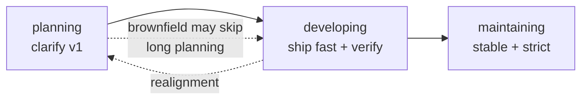
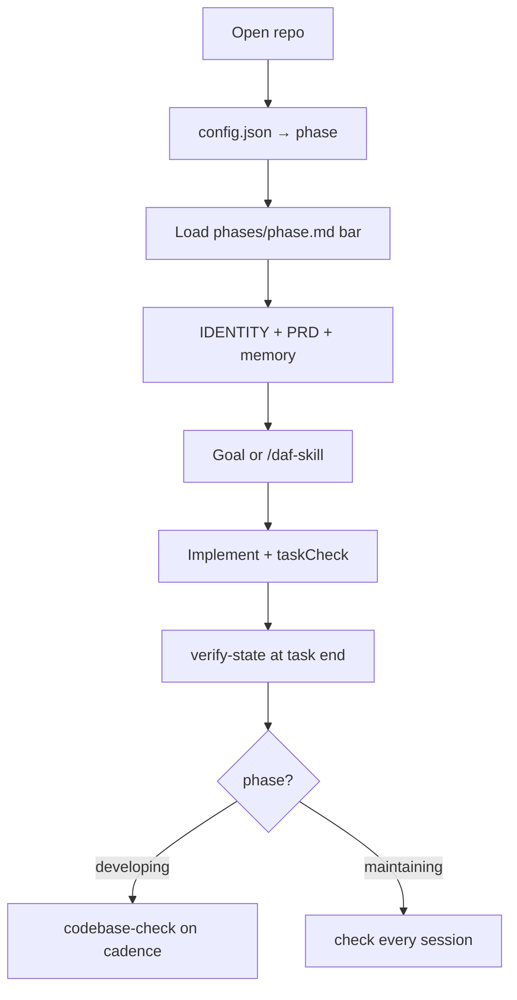

# Daniels Agentic Framework (DAF)

**Prototype fast. Keep a foundation that still makes sense in `maintaining`.**

DAF is for **solo and small-team builders** shipping like a startup: move quickly with an AI agent in the loop, but capture enough structure (PRD, glossary, architecture, verification) that the same repo does not turn into prompt spaghetti six months later.

It is **markdown-first context** — instructions your IDE agent reads every session. You invoke workflows with **skills** (`/daf-onboard`, `/daf-setup`, `/daf-grill-me`, …) in chat. A small **`daf`** CLI (`daf onboard`, `daf health`, `daf version-check`) handles machine bootstrap and status without opening the monorepo.

---

## The idea: speed now, structure that lasts

Most agent setups force a tradeoff:

- **Move fast** → vague rules, no shared vocabulary, “just ship it” until nothing is trustworthy.
- **Stay careful** → heavy process that kills iteration before you have a product.

DAF’s answer is a **phase model**: one explicit stage per project (`planning` → `developing` → `maintaining`). Each phase changes what “done” means — loose while you are finding the product, tighter while you are building v1, strictest when the codebase is the business.


| Phase        | Startup mindset  | What you optimize for                                                                                                                                |
| ------------ | ---------------- | ---------------------------------------------------------------------------------------------------------------------------------------------------- |
| `planning`   | Idea → scoped v1 | Cheap learning: PRD, glossary, architecture sketch; spikes OK; **no net-new product features** yet                                                   |
| `developing` | Build v1 fast    | Short agent sessions, `taskCheck` every goal, periodic full `check` — ship without pretending the repo is “done forever”                             |
| `maintaining` | Product is real  | Fixes and small improvements on stable software; **full `check` every session**; branch guard — the docs and habits from earlier phases pay off here |


The agent reads `.agent/phases/{phase}.md` every session, so behavior matches where you are in the lifecycle — not where you wish you were.




**Layered context** keeps globals separate from the product:


| Layer       | Where              | Holds                                  |
| ----------- | ------------------ | -------------------------------------- |
| **Global**  | `~/.config/agent/` | How you work, skills, stacks, scaffold |
| **Project** | `.agent/`          | Phase, PRD, architecture, memory       |


Global loads first, project wins on conflict — same machine, many repos, one consistent agent.

---

## Phase model (startup path)

This is the spine of DAF. `config.phase` in `.agent/config.json` is the single source of truth.

### `planning` — validate before you build the wrong thing

Use this when the product is still forming (greenfield) or you are re-scoping (`/daf-pivot`, `/daf-realign`).

- `/daf-grill-me` — one question at a time; fills `PRD.md` and recommends a **stack**.
- `/daf-discuss`, `/daf-backlog-add` — explore and park ideas without committing to implementation.
- **Allowed:** spikes and sketches; routine fixes on brownfield adoption.
- **Not allowed:** shipping **net-new v1 features** while still in planning (keeps “we should have written this down” from becoming “we already shipped it”).

**Exit** (enforced by `/daf-phase-transition`): PRD, glossary, architecture, stack set, phase files present. Then `/daf-start` or transition to `developing`.

### `developing` — your fast build loop

Default home while shipping v1.

- Goals live **in the chat only** (no task files under `.agent/`).
- Per goal: implement → `config.taskCheck` (e.g. `npm run test`).
- Session end: bump `verify-state.json`; every N tasks, a **codebase-check** refreshes context and runs full `config.check`.
- Skills: `/daf-new-feature`, `/daf-issue`, `/daf-improvement`, `/daf-backlog-work`, etc.

Optimized for **throughput with guardrails** — not paperwork for its own sake.

### `maintaining` — the foundation earns its keep

Switch here when work is mostly **stability, bugs, and incremental improvement** on software you already rely on.

- Stricter bar: `config.check` green every session task, branch guard, tests when feasible.
- The PRD, glossary, snapshot, and memory you built earlier are what keep the agent aligned without re-explaining the product every week.

You do not “graduate” out of DAF in maintaining — you **tighten** the loop so speed earlier did not mortgage quality later.


| Transition      | When                                                             |
| --------------- | ---------------------------------------------------------------- |
| → `developing`  | Planning exit checklist green; ready to build v1                 |
| → `maintaining` | v1 in use; focus shifts to reliability and small changes         |
| → `planning`    | Major realignment (`/daf-grill-me`, `/daf-pivot`) — docs before big code |


---

## What you need

- **Node.js** 18+
- **An agentic IDE** (Cursor, Claude Code, Codex, …)

Install the **`daf`** CLI once per machine, then use **`/daf-<slug>`** skills in chat for project work (`/daf-setup`, `/daf-issue`, …).

---

## Quick start (first time ever)

### 1 — Install the CLI

**From npm** (recommended once published):

```bash
npm install -g @daniels-agent-framework/cli
```

No global npm write access? Use a user prefix:

```bash
npm install -g @daniels-agent-framework/cli --prefix ~/.local
# fish: fish_add_path ~/.local/bin
```

One-shot without installing:

```bash
npx @daniels-agent-framework/cli onboard --platforms generic,cursor
```

**From this repo** (contributors / before publish):

```bash
git clone <your-fork-or-upstream-url> daniels-agent-framework
cd daniels-agent-framework
npm install && npm run build
npm run daf -- onboard --platforms generic,cursor
```

### 2 — Machine setup

```bash
daf onboard --platforms generic,cursor
```

Installs `~/.config/agent/`, IDE skills, and `platforms.json`. Pick platforms for your IDEs (`generic` is always included).

**Or** in agent chat (if you opened the DAF repo): `/daf-onboard` — the agent runs the same install.

Verify:

```bash
daf health
```

### 3 — Project setup

Open **any** repo in your IDE → chat:

```text
/daf-setup
```

Scaffolds `.agent/`, merges IDE overlays. New products usually start in `planning`.

### 4 — Run the phase path

**Greenfield startup sequence:**

```text
/daf-grill-me              # planning: shape PRD + stack
/daf-phase-transition       # exit planning when checklist passes
/daf-start                  # enter developing; first build session
```

**Later**, when v1 is live and you are mostly fixing and polishing:

```text
/daf-phase-transition       # → maintaining when that matches reality
```

Brownfield: `/daf-setup` interviews you and may set phase/stack immediately.

### Day-to-day (by intent)


| I want to…                     | Skill                           |
| ------------------------------ | ------------------------------- |
| Fix a bug                      | `/daf-issue`                        |
| Improve existing behavior      | `/daf-improvement`                  |
| Add net-new capability         | `/daf-new-feature`                  |
| Redesign something that exists | `/daf-pivot`                        |
| Think without coding           | `/daf-discuss`                      |
| Park / pick up work            | `/daf-backlog-add`, `/daf-backlog-work` |
| Explain code                   | `/daf-how-it-works`                 |
| Standing project rules         | `/daf-remember`                     |
| Capture learnings              | `/daf-retro`                        |


`BACKLOG.md` / `LOGBACK.md` at repo root for follow-ups and done items.

Refresh globals after DAF updates: `/daf-onboard` (ask for `--force` to overwrite). Remove: `/daf-remove` (project), `/daf-remove-global` (machine).

---

## How a session works




The framework does **not** auto-commit, push, or run destructive commands without your OK.

---

## Where files live

**Machine (`/daf-onboard`):**

```
~/.config/agent/          # identity, skills, stacks, scaffold, platforms.json
~/.cursor/skills/daf-*/   # if cursor onboarded
~/.claude/skills/daf-*/   # if claude onboarded
```

**Each project (`/daf-setup`):**

```
.agent/
  config.json             # phase ← startup lifecycle knob
  phases/*.md             # rules per phase
  PRD.md, GLOSSARY.md, ARCHITECTURE.md
  memory/                 # remember, gotchas, learnings, snapshot
```

---

## Learn more


| Doc                                                            | Purpose                        |
| -------------------------------------------------------------- | ------------------------------ |
| `[.agent/phases/planning.md](.agent/phases/planning.md)`       | Planning bar and exit criteria |
| `[.agent/phases/developing.md](.agent/phases/developing.md)`   | Fast build loop                |
| `[.agent/phases/maintaining.md](.agent/phases/maintaining.md)` | Stable-product bar             |
| `[.agent/AGENTS.md](.agent/AGENTS.md)`                         | Load order and agent contract |
| `[.agent/GLOSSARY.md](.agent/GLOSSARY.md)`                     | Canonical terms                |


Chat: `/daf-help`, `/daf-how-it-works <topic>`.

---

## This repository (contributors)


| Path                                                       | Role                              |
| ---------------------------------------------------------- | --------------------------------- |
| `[packages/cli](packages/cli)`                             | Install library                   |
| `[scripts/global-install.mjs](scripts/global-install.mjs)` | Mechanical install for `/daf-onboard` |
| `[templates/global](templates/global)`                     | Identity, skills, scaffold        |
| `[templates/platforms](templates/platforms)`               | Per-IDE templates                 |
| `[.agent/](.agent)`                                        | Dogfooded agent context           |


| Command                                               | Meaning                          |
| ----------------------------------------------------- | -------------------------------- |
| `npm run build`                                       | Build CLI                        |
| `npm run daf -- onboard --platforms cursor`           | Machine install (no agent)       |
| `npm run publish:cli`                                 | Publish CLI to npm (org + login) |
| `npm run daf -- health`                               | Project status dashboard         |
| `npm run check`                                       | typecheck + lint + test          |
| `npm run global-install -- --platforms cursor,claude` | Globals without agent (CI/debug) |


---

## License

[MIT](LICENSE) — Copyright (c) 2026 Daniel Feustel.